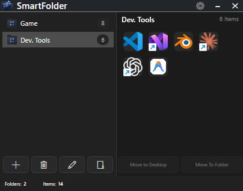

# SmartFolder Free

SmartFolder is a lightweight Windows desktop application that helps you organize application shortcuts into compact desktop widgets.

SmartFolder, uygulama kısayollarınızı küçük ve kullanışlı masaüstü widget'ları içinde düzenlemenizi sağlayan hafif bir Windows uygulamasıdır.

---

## English

### Features

- Create up to 3 SmartFolders
- Add up to 12 applications to each SmartFolder
- Drag and drop application shortcuts
- Compact desktop widgets
- Move shortcuts between SmartFolders
- Move shortcuts back to the desktop
- Convert a SmartFolder into a regular Windows folder
- Saves widget positions automatically
- Starts with Windows
- Designed for Windows 10 and Windows 11

### Screenshots

#### Main application

#### Desktop widget

#### Drag and drop

### Download

Download the latest installer from the **Releases** section of this repository.

### Important notice

SmartFolder Free is currently distributed as an unsigned application. Windows security features may display a warning or block the installer on some computers.

All product names, logos, and brands shown in the screenshots are property of their respective owners. SmartFolder is not affiliated with or endorsed by those companies.

---

## Türkçe

### Özellikler

- En fazla 3 SmartFolder oluşturma
- Her SmartFolder içine en fazla 12 uygulama ekleme
- Sürükle ve bırak yöntemiyle uygulama kısayolu ekleme
- Küçük masaüstü widget'ları
- Kısayolları SmartFolder'lar arasında taşıma
- Kısayolları tekrar masaüstüne çıkarma
- SmartFolder'ı normal bir Windows klasörüne dönüştürme
- Widget konumlarını otomatik kaydetme
- Windows ile birlikte otomatik başlama
- Windows 10 ve Windows 11 desteği

### Ekran görüntüleri

#### Ana uygulama

#### Masaüstü widget'ı

#### Sürükle ve bırak

### İndirme

En güncel kurulum dosyasını bu reponun **Releases** bölümünden indirebilirsiniz.

### Önemli bilgilendirme

SmartFolder Free şu anda dijital olarak imzalanmamış bir uygulama olarak dağıtılmaktadır. Bazı bilgisayarlarda Windows güvenlik özellikleri uyarı gösterebilir veya kurulum dosyasını engelleyebilir.

Ekran görüntülerindeki tüm ürün adları, logolar ve markalar ilgili sahiplerine aittir. SmartFolder bu şirketlerle bağlantılı değildir ve onlar tarafından desteklenmemektedir.

---

## System Requirements / Sistem Gereksinimleri

- Windows 10 or Windows 11
- 64-bit Windows
- Approximately 250 MB of free storage space

## Version

Current version: `1.0.0 Free`

## License

SmartFolder Free is provided for personal use. Redistribution, resale, modification, reverse engineering, and commercial use are not permitted without written permission.
